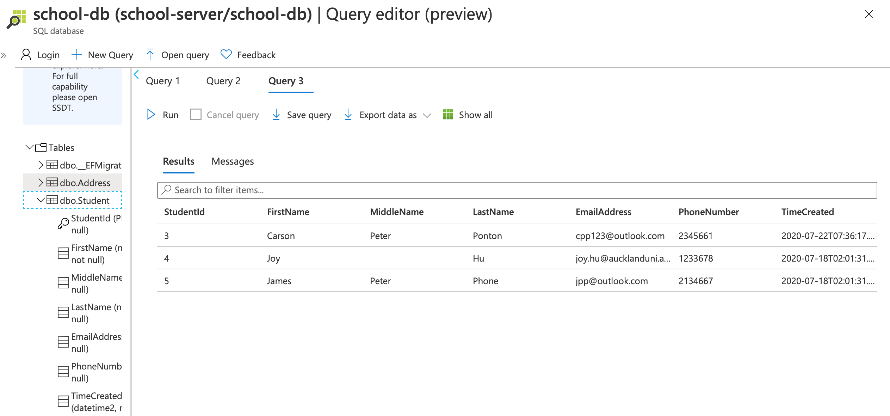
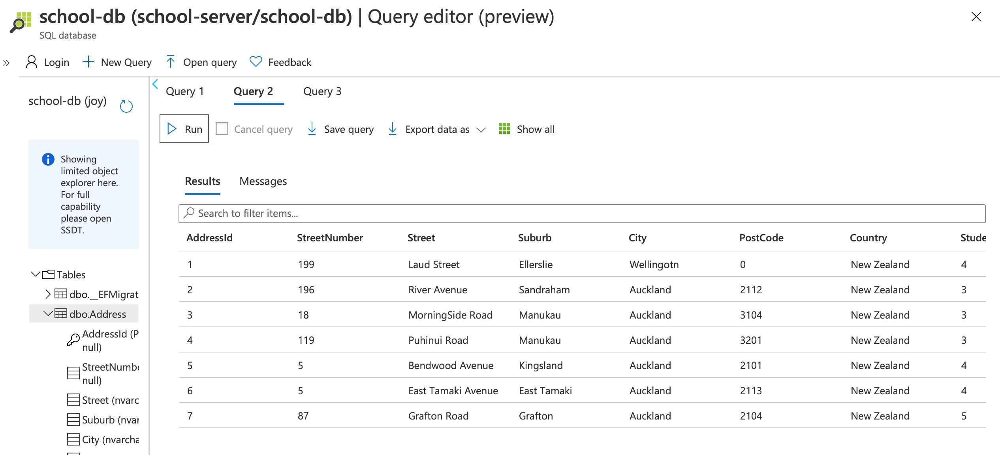
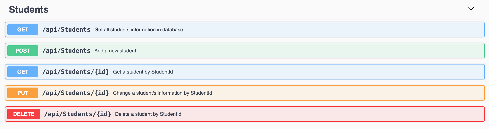
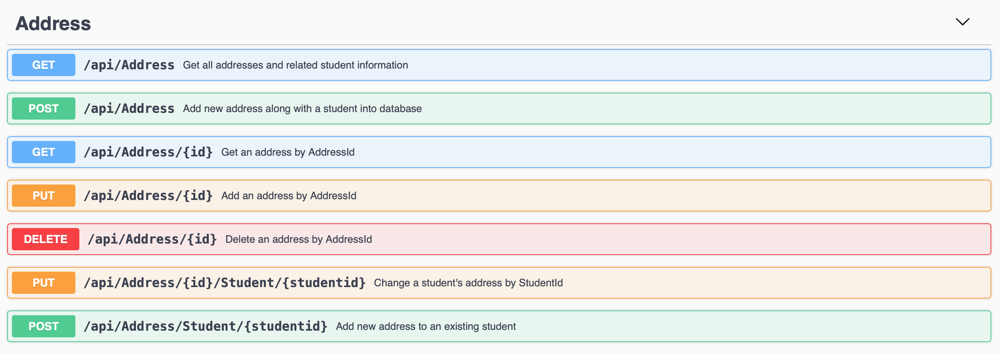
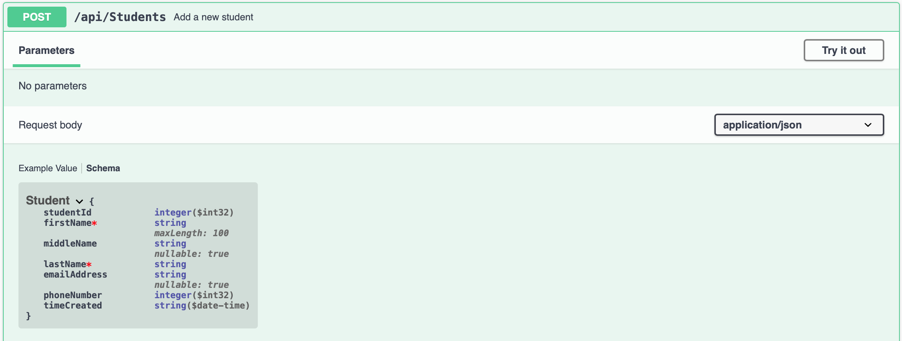
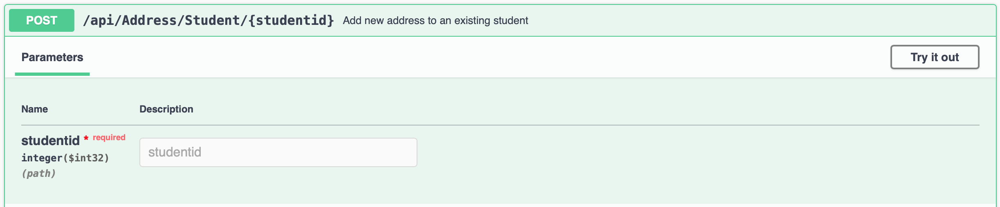
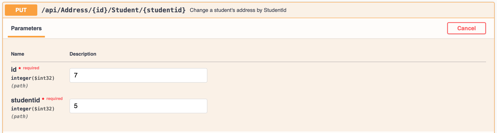
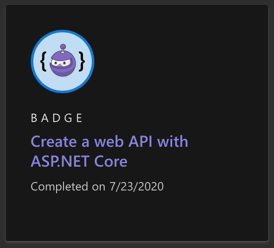

# Content
1. [Project introduction](#api-intro)
2. [Database](#database)
3. [Web API using Swagger](#api)
4. [Learn Module](#module)

# School database API <a name="api-intro"></a>
This project is part of [Microsoft Student Accelerator](https://nzmsa.netlify.app/) 2020 [Database and API](https://github.com/NZMSA/2020-Phase-1/tree/master/Databases%20and%20API) path.
It is a simple ASP.NET Core web API using Swagger UI that hosted on Azure, you could access [here](https://msa-school-sims.azurewebsites.net/index.html).

This service supports adding, viewing, modifying, and removing data of the database.

# Database <a name="database"></a>
There are two relations hosted in the database. One is called **Student** and another is called **Address**. We assume that each student related to 0 to more address, and each address related to at least one student. Address that not related to 0 student is not allowed in the database.

In **Student** relation, there are 5 attributes.

| Attribute name     | Data type    | Description | Required?|
| :------------- | :------------- | :------------|:----------|
| StudentId(**PK**)      | integer       | System generated student id| System generated |
|FirstName| string| student's first name| Required|
|MiddleName| string| student's middle name| Not required|
|LastName| string| student's family name| Required|
|EmailAddress| string| email address | Not required|
|PhoneNumber| integer | student's mobile phone| Not required|
|TimeCreated| Date | system time of creating tuple| System generated|

In **Address** relation, there are 8 attributes.

| Attribute name | Data type | Description | Required? |
| :------------- | :------------- | :-----------| :-----------|
| AddressId(**PK**)   | integer    | unique id for each address| System generated |
|StudentId(**FK**) |integer| related student's id| Required|
|StreetNumber| integer| street number | Not required |
|Street | string | street name| Not required|
|Suburb | string | Suburb name| Not required|
|City | string| city name| Not required|
|PostCode | integer | post code of the address| Not required|
|Country| string| resident country of student| Required|

### Screenshot of each relation in database
**Student**


**Address**



# Web API <a name ="api"></a>
There are two APIs in the page, each API support the **CRUD** methods of each relation.

### Endpoints and sample requests
Each relation has different endpoints. The screenshots below show endpoints of each relation and corresponding description.




There are some sample requests using different endpoints.
```
https://msa-school-sims.azurewebsites.net/api/Address/4
https://msa-school-sims.azurewebsites.net/api/Students/5
https://msa-school-sims.azurewebsites.net/api/Address/7/Student/5
```


### Methods and responses
For each relation, API supports the standard **CRUD** methods.

###### Create
Using **POST** will create a tuple to corresponding relation. The primary key `StudentId` or `AddressId` is generated by the system. You do not need to put id when you create a new data.
You can check the schema and understand the constraint before you insert the data.


By default, the **POST** method of address is used to add a new address along with a new student to the database. If the address is related to an existing student, there is an additional **POST** method of **Address** API to address this request.


The HTTP status code `201` means a tuple has been added to the corresponding relation successfully.

###### Read
Using **GET** will retrieve the a tuple using the primary key. The result data is formatted in JSON.
An example:
Retrieve an address tuple via `AddressId`

```JSON
{
  "addressId": 4,
  "streetNumber": 119,
  "street": "Puhinui Road",
  "suburb": "Manukau",
  "city": "Auckland",
  "postCode": 3201,
  "country": "New Zealand",
  "studentId": 3,
  "student": {
    "studentId": 3,
    "firstName": "Carson",
    "middleName": "Peter",
    "lastName": "Ponton",
    "emailAddress": "cpp123@outlook.com",
    "phoneNumber": 2345661,
    "timeCreated": "2020-07-22T07:36:17.102"
  }
}
```

The HTTP status code `200` means a tuple matching the provided `id` in the database. A tuple is included in the response body in the media type as defined in the `Accept` HTTP request header.

code `404` means a tuple matching the provided `id` is not found in database.

###### Update

Using **PUT** method in each API to update a tuple in relation. You need to give id of tuple make sure the tuple for modification is valid.

There is additional **PUT** method in **Address** API which requires both `StudentId` and `AddressId`. This method allows to to update an address of a given student.


The HTTP status code `400` means a bad request, implies that the request `id` is invalid.

code `204` means a tuple matching the provided `id` update successfully in the database.

###### Delete
Using **DELETE** method to delete a tuple in relation. Because of the constraint we mentioned before, delete a student tuple using **DELETE** can result in error. If a student tuple which relate to any address tuple cannot be delete until the corresponding address tuple have been deleted.

The HTTP status code `404` means a tuple matching the provided `id` does not exist in the databse.

code `204` means a tuple matching the provided `id` delete successfully in the database. 


# Microsoft Learn Module <a name="module"></a>

